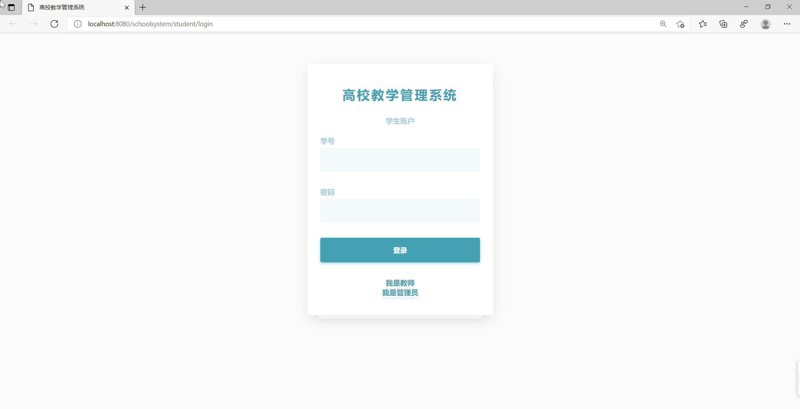
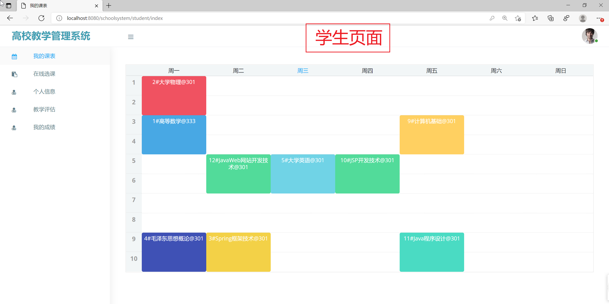
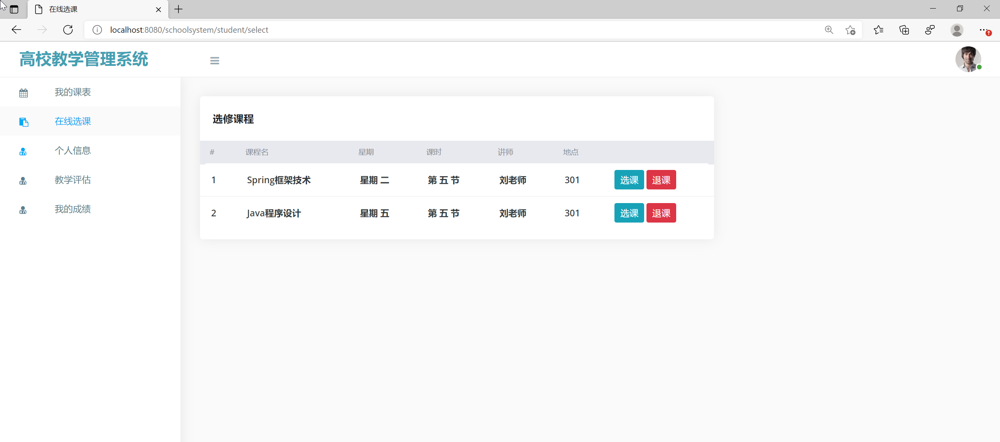
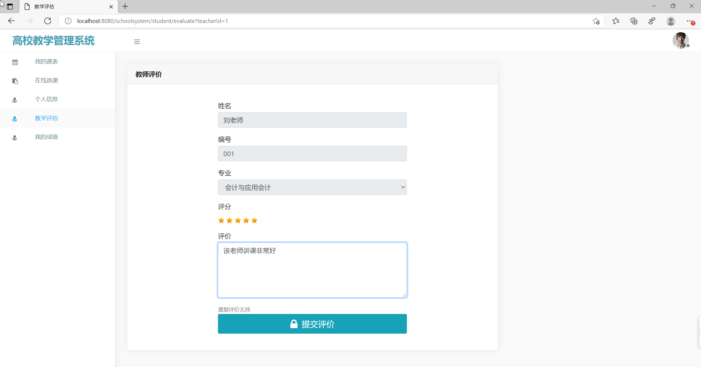
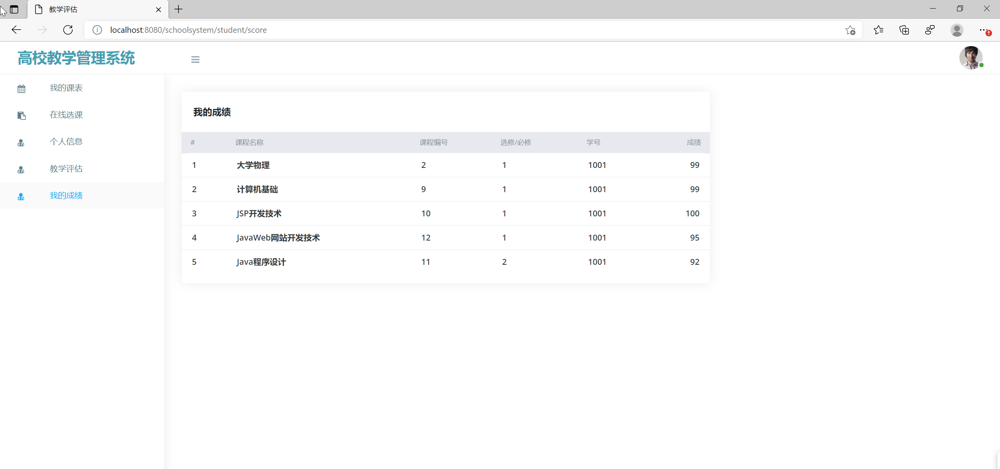
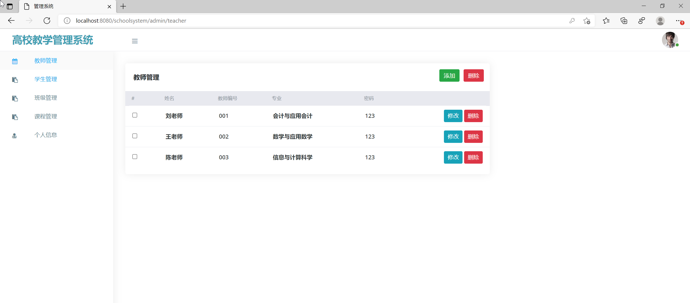
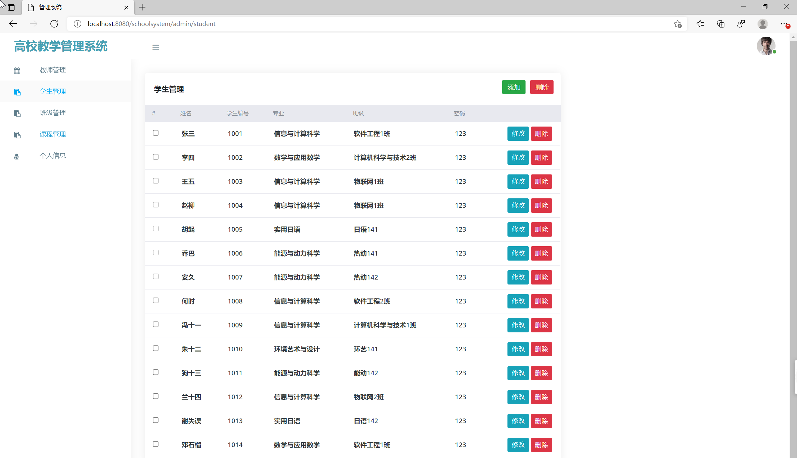
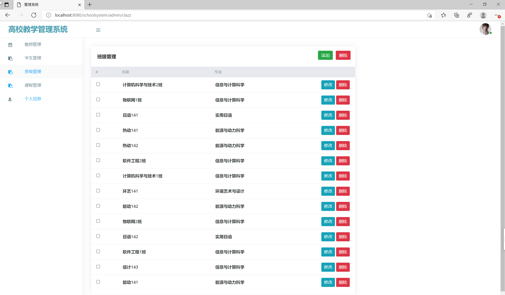
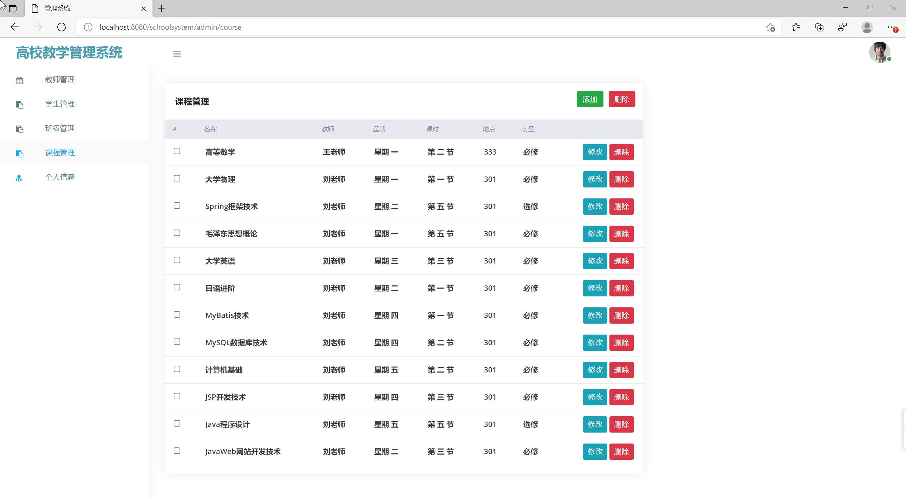

## 基于SSM实现的高校教学管理系统

###  获取sql数据库文件: 从戎源码网 (https://armycodes.com/) QQ: 386869957 QQ群: 377586148
###  所有系统地址: (https://github.com/YuLin-Coder/AllProjectCatalog) 
###  所有项目以及源代码本人均调试运行无问题 可支持远程安装部署调试、定制修改、代码讲解

## 项目介绍
基于SSM实现的高校教学管理系统,
本高校教学管理系统分为学生模块、教师模块和管理员模块，分别对应三种角色：学生、教师和管理员。

各模块的功能如下：
(一)、学生模块
1.我的课表：学生可以查看自己的课表
2.在线选课：学生可以在线选课或退课
3.个人信息：学生可以修改自己的信息
4.教学评估：学生可以对老师进行评价打分
5.我的成绩：学生可以查看个人成绩信息
(二)、教师模块
1.我的课表：教师可以查看自己的课表，对学生的课程成绩进行打分
2.个人信息：教师可以修改自己的信息
3.退出系统：教师可以退出登陆
(三)、管理员模块：
1.教师管理：管理员可以对教师信息进行添加、查看、修改或删除
2.学生管理：管理员可以对学生信息进行添加、查看、修改或删除
3.班级管理：管理员可以对班级信息进行添加、查看、修改或删除
4.课程管理：管理员可以对课程信息进行添加、查看、修改或删除
5.个人信息：管理员可以修改自己的信息

## 项目技术
- 编程语言：Java
- 数据库：MySQL
- 前端技术：JSP、JavaScript、bootstrap、JQuery
- 后端技术：Spring、SpringMVC、MyBatis

## 运行环境
- JDK版本：JDK1.8及以上
- 开发工具：IDEA、Ecplise、Myecplise都可以
- 数据库: MySQL5.7及以上
- Maven：maven3.0及以上

## 运行截图

